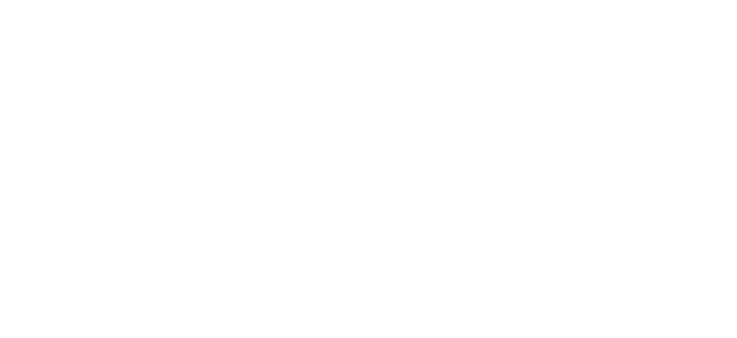

<p align="center">
  <picture>
    <source media="(prefers-color-scheme: dark)" srcset="static/images/SSTE-WHITE.png" />
    <source media="(prefers-color-scheme: light)" srcset="static/images/SSTE-WHITE.png" />
    
  </picture>
</p>

<p align="center">
  <strong>Maturitní Příprava 2026</strong><br>
  <sub>SŠTE Olomoucká · Informační Technologie</sub>
</p>

<p align="center">
  <a href="https://sdragonex.github.io/Maturita"></a>
</p>

---

## 📚 Předměty

| Předmět | Témata | PDF |
|---------|--------|-----|
| 🇬🇧 Anglický jazyk | 20 témat (ústní profilová zkouška) | [MZ-AJ.pdf](static/MZ-AJ.pdf) |
| 🇨🇿 Český jazyk a literatura | Školní seznam 97 literárních děl | [MZ-KNIHY.pdf](static/MZ-KNIHY.pdf) |
| 💻 Aplikační software | 26 témat (grafika, Blender, UX...) | [MZ-IT.pdf](static/MZ-IT.pdf) |
| 🌐 Počítačové sítě a programování | 26 témat (sítě, C#, WPF...) | [MZ-IT.pdf](static/MZ-IT.pdf) |
| 🎓 Maturitní práce s obhajobou | 7 oblastí | [MZ-IT.pdf](static/MZ-IT.pdf) |

## 📁 Struktura

```
content/posts/   — maturitní témata (Markdown)
static/          — PDF soubory a obrázky
templates/       — HTML šablony
sass/            — styly
```

---

<sub>© 2026 [Dany Chaker](https://github.com/SDragonex)</sub>
